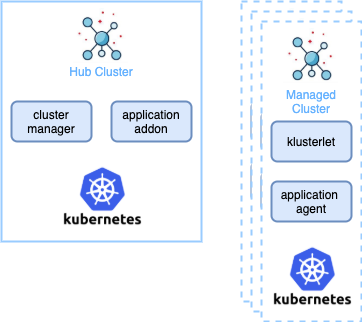

## Open Cluster Management

Welcome! The open-cluster-management.io project is focused on enabling end to end visiblity and control across your Kubernetes clusters.

open-cluster-management uses a hub - agents model. A hub centralizes control. Agents (which we call klusterlet) reside in each cluster to manage registration to the hub and execute hub instructions.

There are a number of key use cases that are enabled by this project.

### Cluster registration

API and controller for cluster registration and manifests delivery to clusters. Simple core functions to connect clusters (klusterlet) to the hub. Other components run upon this base. The following repositories describe the API and controllers for registration.

* https://github.com/open-cluster-management/api
* https://github.com/open-cluster-management/registration
* https://github.com/open-cluster-management/work

### Delivery, upgrade and configuration of applications on Kubernetes clusters

* Centrally create, update, and delete Kubernetes clusters across multiple
private and public clouds
* Automatically deploy applications to specific clusters by subscribing
to different workload (resource) channels, such as GitHub, Helm
repository, ObjectStore, and resource templates.

The application model defines a Kubernetes-first way of describing the application. Your existing Kubernetes apps or `kustomized` apps can be adapted with the addition of a few new objects: `Channel`, `Subscription`, and `PlacementRule`. Changes made to the app are then easily delivered to managed clusters based on the dynamic placement engine.

The following repositories describe the underlying API and controllers for the app model:

* https://github.com/open-cluster-management/multicloud-operators-subscription
* https://github.com/open-cluster-management/multicloud-operators-placementrule
* https://github.com/open-cluster-management/multicloud-operators-subscription-release
* https://github.com/open-cluster-management/multicloud-operators-channel

There is also a demonstrations available at https://github.com/open-cluster-management/demo-subscription-gitops .
